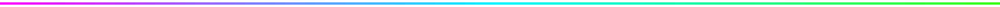

[;Computer+Science+Student;Aspiring+SOC+Analyst)](https://git.io/typing-svg)

  
  
Frontend Dev • CS Student • SOC Analyst (aspiring)

  <!-- small theme badge -->
   
  

  

---

<!-- neon badge row -->

  
  
  
  

---

## About

**Frontend Developer (Upwork) · Computer Science Student · SOC Analyst (learner)**

I design and build modern, responsive user interfaces focused on performance and accessibility. I deliver production-ready React apps with Tailwind CSS and pragmatic testing.

Currently: freelancing on Upwork • studying Meta Frontend cert • learning SOC workflows and SIEM tools.

What I build:

- Fast, accessible single-page apps (React + Vite)
- Component-driven UI systems (Tailwind, design tokens)
- Small automation scripts and developer tools

Skills & tools:

   

Availability: Open for frontend freelance work and collaboration. Message me on Upwork or LinkedIn.

## Featured Projects

- cyberSecurity — https://github.com/AMAIDI-MOHAMED/cyberSecurity
- Portfolio — https://github.com/AMAIDI-MOHAMED/AMAIDI-MOHAMED

## Skills (high level)

- Frontend: HTML, CSS, JavaScript, React, Tailwind
- Tools: Git, VS Code, Figma
- Learning: Cybersecurity basics, SIEM, incident response

## Contact

---

Thanks for visiting — explore my repos or contact me via the badges above.
