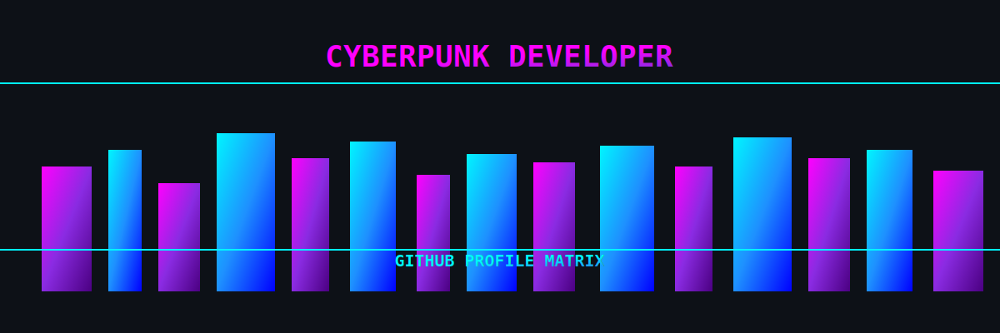
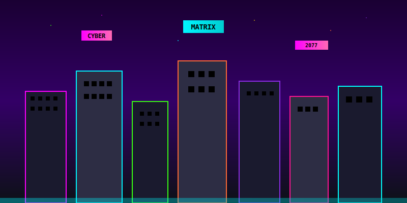
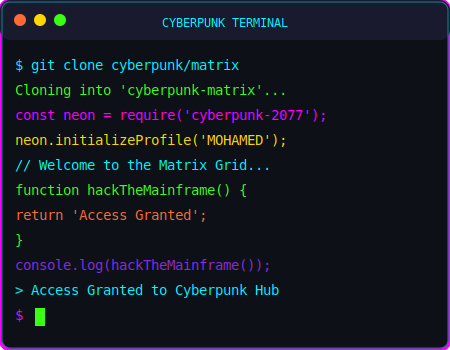
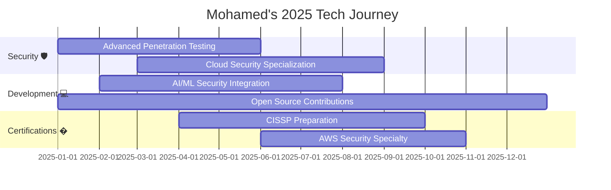

<div align="center">
  
</div>

<!-- TOC -->
## Table of Contents
- [About Me](#-about-me--à-propos-de-moi)
- [Tech Stack & Skills](#-tech-stack--skills--compétences-techniques)
- [GitHub Analytics & Live Stats](#-github-analytics--live-stats--statistiques-en-direct)
- [Featured Projects](#-featured-projects--projets-en-vedette)
- [Local Cyberpunk Assets](#-local-cyberpunk-assets)
- [Contact](#-contact)

<div align="center">

[;Computer+Science+Student;Aspiring+SOC+Analyst)](https://git.io/typing-svg)

</div>

<div align="center">
  
[](https://upwork.com)
[](https://coursera.org)
[](https://github.com/AMAIDI-MOHAMED)
[](https://en.wikipedia.org/wiki/Tunisia)

</div>

<div align="center">

[](https://github.com/AMAIDI-MOHAMED)
[](https://github.com/AMAIDI-MOHAMED)
[](https://github.com/AMAIDI-MOHAMED)

</div>



<!-- neon divider -->
<div align="center">
  
</div>

---

## 🇹🇳 About Me | À propos de moi

### 👨‍💻 Frontend Developer & Computer Science Student

<table>
<tr>
<td width="60%">

**🎯 Professional Summary**
- 🚀 Frontend Developer (Upwork) — building responsive, accessible interfaces for clients.
- 🎓 Computer Science Student — practical coursework and projects.
- 📜 Meta Frontend Certificate — in progress.
- 🛡️ Aspiring SOC Analyst — focused on SIEM, incident response, and hands-on labs.
- 🗣️ Languages: Arabic, French, English

**💼 Technical Expertise**
- ⚛️ Frontend: React, HTML5, CSS3, JavaScript, TypeScript
- 🎨 Styling: Tailwind CSS, Bootstrap, SASS
- 🔧 Tools: Vite, Webpack, Git, VS Code
- 🐍 Backend basics: Python, Node.js, MongoDB
- 🛡️ Security learning: SIEM tools, network basics, incident handling

**🚀 Current Focus**
- Building polished UI components and client projects on Upwork
- Advancing through the Meta Frontend curriculum
- Practicing SOC workflows and labs

</td>
<td width="40%">
<div align="center">

### 🌟 Quick Stats


### 🎨 Frontend Skills
```
React.js     ██████████ 90%
JavaScript   █████████░ 85%
Tailwind CSS ██████████ 95%
HTML/CSS     ██████████ 100%
TypeScript   ████████░░ 75%
```

### 🛡️ Security Learning
```
Network Sec  ███████░░░ 65%
SIEM Tools   ██████░░░░ 55%
Pentesting   █████░░░░░ 45%
```

</div>
</td>
</tr>
</table>

<br clear="both"/>

### � Current Goals & Status
- 🔭 **Working on:** React.js projects for international clients
- 🌱 **Learning:** Meta Frontend Professional Certificate on Coursera
- 👯 **Open to:** Frontend development collaborations & SOC analyst opportunities
- �️ **Career Goal:** Transition to SOC Analyst role
- 💼 **Upwork:** Building strong client relationships as Frontend Developer
- � **Education:** Computer Science degree in progress
- ⚡ **Fun fact:** I can switch between frontend frameworks as easily as I switch between languages! 😄
---

## 🛠️ Tech Stack & Skills | Compétences Techniques

<div align="center">

### 🎨 Frontend Development
[](https://html.spec.whatwg.org/)
[](https://www.w3.org/Style/CSS/)
[](https://developer.mozilla.org/en-US/docs/Web/JavaScript)
[](https://www.typescriptlang.org/)
[](https://reactjs.org/)
[](https://nextjs.org/)

### 🎯 CSS Frameworks & Styling
[](https://tailwindcss.com/)
[](https://getbootstrap.com/)
[](https://sass-lang.com/)
[](https://styled-components.com/)
[](https://mui.com/)

### ⚙️ Backend & Programming
[](https://python.org)
[](https://nodejs.org/)
[](https://expressjs.com/)
[](https://www.mongodb.com/)
[](https://www.postgresql.org/)

### 🔧 Tools & Development Environment
[](https://code.visualstudio.com/)
[](https://git-scm.com/)
[](https://github.com/)
[](https://vitejs.dev/)
[](https://webpack.js.org/)
[](https://www.npmjs.com/)

### 🛡️ Cybersecurity & SOC Tools
[](https://www.kali.org/)
[](https://www.wireshark.org/)
[](https://nmap.org/)
[](https://www.metasploit.com/)
[](https://portswigger.net/burp)
[](https://en.wikipedia.org/wiki/Security_information_and_event_management)

### 🏢 Professional Platforms
[](https://upwork.com)
[](https://coursera.org)
[](https://linkedin.com)

### 🎓 Currently Learning
[](https://www.coursera.org/professional-certificates/meta-front-end-developer)
[](https://www.comptia.org/certifications/security)
[](https://www.comptia.org/certifications/cybersecurity-analyst)

</div>

---

## 📊 GitHub Analytics & Live Stats | Statistiques en Direct

<div align="center">
   
  
</div>

<div align="center">
  
</div>

<div align="center">
  
</div>

### 📈 Profile Summary
<div align="center">

[](https://github.com/ryo-ma/github-profile-trophy)

</div>

---

## 🎴 Local Cyberpunk Assets

Showcase of images pulled from the repo's `assets/` folder (linked relatively so they render on GitHub):

<div align="center">
  
  
</div>

<div align="center">
  
  
</div>

<div align="center">
  
</div>

<details align="center">
<summary><strong>📊 More GitHub Insights</strong></summary>
<br>

  [](https://upwork.com)
  [](https://coursera.org)
  [](https://github.com/AMAIDI-MOHAMED)
  [](https://en.wikipedia.org/wiki/Tunisia)


  [](https://github.com/AMAIDI-MOHAMED)
  [](https://github.com/AMAIDI-MOHAMED)
  [](https://github.com/AMAIDI-MOHAMED)
  [](https://git.io/typing-svg)

</details>

---

## 🚀 Featured Projects | Projets en Vedette

<div align="center">

[](https://github.com/AMAIDI-MOHAMED/cyberSecurity)
[](https://github.com/AMAIDI-MOHAMED/AMAIDI-MOHAMED)

</div>

<div align="center">

### 🔥 Project Highlights
| 🛡️ Security | ⚡ Performance | � Web Dev | 🤖 Automation |
|:---:|:---:|:---:|:---:|
| Penetration Testing | Code Optimization | Modern UI/UX | CI/CD Pipelines |
| Vulnerability Assessment | System Performance | Responsive Design | Infrastructure as Code |
| Security Hardening | Database Tuning | Progressive Web Apps | Monitoring Solutions |
| Threat Modeling | Network Optimization | Accessibility Standards | DevSecOps Integration |

</div>

---

## 🌟 Random Dev Quote | Citation Développeur

<div align="center">
  
[](https://github.com/piyushsuthar/github-readme-quotes)

</div>

---

## 📫 Contact

If you'd like to reach out, connect via:

[](mailto:mohamed.amaidi.dev@gmail.com)
[](https://linkedin.com/in/mohamed-amaidi)
[](https://twitter.com/mohamed_amaidi)
[](https://discord.gg/mohamed-amaidi)


## 💼 Professional Experience & Learning | Expérience Professionnelle

<div align="center">

### 🎯 Current Learning Path

<table>
<tr>
<td width="33%">
<h4 align="center">🎓 Meta Frontend Certificate</h4>
<div align="center">


[](https://coursera.org)

**Modules:**
- HTML/CSS Advanced
- JavaScript Programming  
- React Development
- Version Control
- UI/UX Design Principles

</div>
</td>
<td width="33%">
<h4 align="center">💼 Upwork Freelancing</h4>
<div align="center">


[](https://upwork.com)

**Services:**
- Frontend Development
- React.js Applications
- Tailwind CSS Styling
- Responsive Design
- UI/UX Implementation

</div>
</td>
<td width="33%">
<h4 align="center">🛡️ SOC Analyst Roadmap</h4>
<div align="center">


[](https://github.com/AMAIDI-MOHAMED)

**Learning Track:**
- Network Security
- SIEM Tools (Splunk, ELK)
- Incident Response
- Threat Hunting
- Security+, CySA+ Prep

</div>
</td>
</tr>
</table>

</div>

### 🎨 Skills & Expertise Overview

<div align="center">

<table>
<tr>
<td width="50%">

### 🎯 Frontend Development
```
HTML5        ████████████ 100%
CSS3         ████████████ 100%
JavaScript   ███████████░  95%
React.js     ████████████  90%
Tailwind     ████████████  95%
TypeScript   ████████░░░░  75%
```

### 🔧 Development Tools
```
VS Code      ████████████ 100%
Git/GitHub   ████████████  95%
Figma        ████████░░░░  80%
Vite         ████████████  90%
```

</td>
<td width="50%">

### 🐍 Backend & General
```
Python       ████████░░░░  80%
Node.js      ███████░░░░░  70%
MongoDB      ████████░░░░  75%
PostgreSQL   ███████░░░░░  65%
```

### 🛡️ Cybersecurity (Learning)
```
Network Sec  ███████░░░░░  65%
SIEM Tools   ██████░░░░░░  55%
Pentesting   █████░░░░░░░  45%
Incident Res ████░░░░░░░░  40%
```

</td>
</tr>
</table>

</div>

---

## 🎯 Current Focus & Goals | Objectifs Actuels

<div align="center">

### 🔥 2025 Roadmap


```mermaid
gantt
    title Mohamed's 2025 Tech Journey
    dateFormat  YYYY-MM-DD
    section Security 🛡️
    Advanced Penetration Testing    :2025-01-01, 2025-06-01
    Cloud Security Specialization  :2025-03-01, 2025-09-01
    section Development 💻
    AI/ML Security Integration     :2025-02-01, 2025-08-01
    Open Source Contributions     :2025-01-01, 2025-12-31
    section Certifications �
    CISSP Preparation             :2025-04-01, 2025-10-01
    AWS Security Specialty        :2025-06-01, 2025-11-01
```

</div>

### 🎮 Coding Stats

<div align="center">

<!--START_SECTION:waka-->
```text
Security Tools   █████████████████████░░░░   87.4 % 
Python          ██████████████████░░░░░░░   73.8 % 
JavaScript      ████████████░░░░░░░░░░░░░   51.2 % 
Bash Scripts    ██████████░░░░░░░░░░░░░░░   42.6 % 
Documentation   ████████░░░░░░░░░░░░░░░░░   34.1 % 
```
<!--END_SECTION:waka-->

</div>

---

## 💡 Philosophy & Approach | Philosophie et Approche

<div align="center">

### 🧠 My Cybersecurity Mindset

> **"في الأمن السيبراني، الوقاية خير من العلاج"**  
> *"In cybersecurity, prevention is better than cure"*

</div>

<table align="center">
<tr>
<td width="50%" align="center">
  
### 🔐 Security First
- **Zero Trust Architecture**
- **Defense in Depth**  
- **Continuous Monitoring**
- **Threat Intelligence**

</td>
<td width="50%" align="center">

### 🚀 Innovation Driven
- **Emerging Technologies**
- **AI-Powered Security**
- **Automation & Orchestration**
- **Cloud-Native Solutions**

</td>
</tr>
</table>

---

## 🤝 Let's Connect & Collaborate | Connectons-nous

<div align="center">

### 📬 Reach Out To Me!

[](mailto:mohamed.amaidi.dev@gmail.com)
[](https://linkedin.com/in/mohamed-amaidi)
[](https://twitter.com/mohamed_amaidi)
[](https://discord.gg/mohamed-amaidi)

### 💬 Available For:
- 🔐 **Security Consultations**
- � **Open Source Collaborations** 
- 🎓 **Mentoring & Teaching**
- 💼 **Freelance Projects**
- 🎤 **Tech Talks & Workshops**

</div>

### 🌍 From Tunisia with ❤️

<div align="center">
  
*"Building a more secure digital future, one commit at a time"*  
*"نبني مستقبلاً رقمياً أكثر أماناً، كود واحد في كل مرة"*

</div>

---

<div align="center">
  
### 🎉 Thanks for visiting! | Merci de votre visite!


</div>

<div align="center">
  
</div>

---

### 🎯 Quick Stats Summary

<div align="center">


**💡 Daily Motivation:** *"Code with passion, secure with purpose, grow with persistence!"*

</div>
