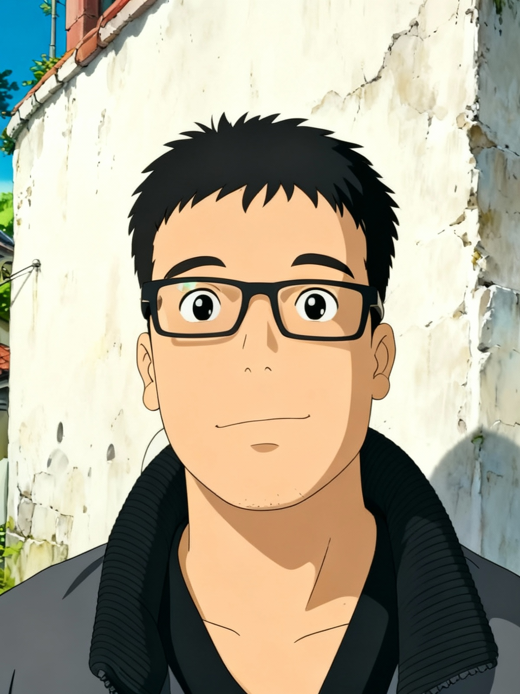

<div align="center">



# Mohamed Amaidi


<br/>

📍 **Tunisia** &nbsp;•&nbsp; 🛡️ **Targeting SOC Internships** &nbsp;•&nbsp; 💼 **Open to Frontend Freelance**

<br/>

[](mailto:amaidim30@gmail.com)
[](https://www.linkedin.com/in/mohamed-amaidi-a51093336)
[](https://leetcode.com/u/amaidimohamed/)
[](https://www.upwork.com/freelancers/~01f12952ef7492919c)


</div>

---

## 🛡️ About Me
```python
analyst = {
    "role":         "Aspiring SOC Analyst",
    "location":     "Tunisia 🇹🇳",
    "focus":        ["Threat Detection", "Incident Response", "Network Security"],
    "tools":        ["Wazuh", "Wireshark", "Linux", "Python"],
    "training":     ["TryHackMe", "HackTheBox", "CCNA"],
    "background":   "Frontend Developer (React · Tailwind CSS)",
    "competitive":  "C++ on Codeforces — analytical problem solving",
    "seeking":      ["SOC Internship", "Frontend Freelance"]
}
```

I'm transitioning into **cybersecurity** with a focus on **SOC operations and threat detection**. I study network traffic analysis, host-based monitoring with **Wazuh**, and security tooling through hands-on labs on **TryHackMe** and **HackTheBox**.

My background in **frontend development** gives me a practical edge — I understand web attack surfaces (XSS, CSRF, injection) from the inside. My **competitive programming** habit in C++ sharpens the logical thinking that SOC work demands.

---

## 🔐 Cybersecurity Skills

<div align="center">

### **Security & Monitoring**


### **Networking**


### **Labs & Practice**


</div>

---

## 🛠️ Frontend Background

> *I maintain frontend skills for freelance work and because understanding the web stack makes me a better security analyst.*

<div align="center">


</div>

---

## 🔬 Security Projects & Labs

<div align="center">

<table>
<tr>
<td width="50%">

<h3 align="center">🛡️ Cybersecurity Notes & Labs</h3>

<div align="center">
<a href="https://github.com/AMAIDI-MOHAMED/cyberSecurity" target="_blank">

</a>
</div>

<br/>

Documentation of security concepts, tools, and hands-on lab walkthroughs.

**Focus:** Network security · Linux · Monitoring tools

</td>

<td width="50%">

<h3 align="center">🌐 CCNA Networking Course</h3>

<div align="center">
<a href="https://github.com/AMAIDI-MOHAMED/CCNA-Course" target="_blank">

</a>
</div>

<br/>

Structured notes from CCNA studies — subnetting, routing, switching, protocols.

**Focus:** TCP/IP · VLANs · Routing protocols

</td>
</tr>

<tr>
<td width="50%">

<h3 align="center">⚔️ Problem Solving (C++)</h3>

<div align="center">
<a href="https://github.com/AMAIDI-MOHAMED/Problem_Solving" target="_blank">

</a>
</div>

<br/>

Codeforces solutions — competitive programming builds the analytical muscle for SOC work.

**Stack:** C++ · Algorithms · Data Structures

</td>

<td width="50%">

<h3 align="center">🌐 Personal Portfolio</h3>

<div align="center">
<a href="https://amaidi.netlify.app" target="_blank">

</a>
</div>

<br/>

Responsive portfolio built with React + Tailwind CSS.

**Stack:** React · Vite · Tailwind CSS

</td>
</tr>
</table>

</div>

---

## 🏆 Achievements

<div align="center">

| 🎯 **Category** | 🏅 **Achievement** |
|:----------------|:-------------------|
| 🛡️ **Security Labs** | TryHackMe & HackTheBox — active learner |
| 🌐 **Networking** | CCNA — in progress |
| ⚔️ **Competitive Programming** | Codeforces (C++) + 84+ LeetCode problems solved |
| 📜 **Certifications** | freeCodeCamp Responsive Web Design (July 2025) |
| ⭐ **Freelance** | Upwork: 2 jobs · 100% success rate · 5-star rating |
| 🦈 **GitHub** | Pull Shark · Quickdraw |

</div>

---

## 📊 GitHub Stats

<div align="center">


</div>

---

## 📬 Let's Connect

<div align="center">

### 🤝 **I'm Currently Open To:**

<table>
<tr>
<td align="center" width="50%">
  <strong>🛡️ SOC Internships</strong><br/>
  <sub>Threat detection · Monitoring · Incident response</sub>
</td>
<td align="center" width="50%">
  <strong>💼 Frontend Freelance</strong><br/>
  <sub>React · Tailwind CSS · Landing pages · Web apps</sub>
</td>
</tr>
</table>

<br/>

**📧 Email:** [amaidim30@gmail.com](mailto:amaidim30@gmail.com)

[](https://www.linkedin.com/in/mohamed-amaidi-a51093336)
[](https://www.upwork.com/freelancers/~01f12952ef7492919c)
[](https://amaidi.netlify.app)

<br/>

**💬 I typically respond within 24 hours.**

</div>

---

<div align="center">


<sub>Built with ❤️ by Mohamed Amaidi • Updated March 2026</sub>

</div>
