<div align="center">


# 👋 Hi, I'm Mohamed Amaidi


<br/>

📍 **Tunisia** • 💼 **Open to Opportunities**

<br/>

[](mailto:amaidim30@gmail.com)
[](https://www.linkedin.com/in/mohamed-amaidi-a51093336)
[](https://www.upwork.com/freelancers/~01f12952ef7492919c)
[](https://leetcode.com/u/amaidimohamed/)

<br/>

[]({{RESUME_URL}})

<br/>


</div>

---

## 🚀 About Me

```typescript
const mohamed = {
    role: "Frontend Developer",
    location: "Tunisia 🇹🇳",
    specialization: ["React", "Vite", "Tailwind CSS"],
    currentFocus: "Building fast, responsive web applications",
    learning: ["Cybersecurity", "SOC Analysis", "Python", "Splunk", "Wireshark"],
    certifications: ["Meta Frontend Developer (In Progress)", "freeCodeCamp RWD"],
    availability: "Open to freelance, internships, and full-time roles"
};
```

I'm a **Frontend Developer** specializing in building **fast, responsive web applications** with **React**, **Vite**, and **Tailwind CSS**. I transform design mockups into **pixel-perfect, production-ready interfaces**.

Currently completing the **Meta Frontend Developer Professional Certificate** while exploring **cybersecurity** fundamentals (Splunk, Wireshark, Python) as an aspiring **SOC Analyst**. 

### ✨ What I Deliver

<table>
<tr>
<td>

- ✅ **Clean, maintainable code** following best practices
- ✅ **Pixel-perfect implementation** from Figma to production
- ✅ **Responsive design** across all devices

</td>
<td>

- ✅ **Clear communication** and on-time delivery
- ✅ **5-star rated service** on Upwork
- ✅ **100% success rate** (2 jobs completed)

</td>
</tr>
</table>


## 🛠️ Tech Stack

<div align="center">

### **Frontend Development**


### **Tools & Platforms**


### **Currently Learning**


</div>


## 💼 Featured Projects

<div align="center">

<table>
<tr>
<td width="50%">

<h3 align="center">🌐 Personal Portfolio</h3>

<div align="center">
<a href="https://github.com/AMAIDI-MOHAMED/AMAIDI-MOHAMED. github.io" target="_blank">

</a>
<a href="https://amaidi.netlify.app" target="_blank">

</a>
</div>

<br/>

**Modern, fully responsive portfolio** showcasing my projects and skills.

**Tech Stack:** React • Vite • Tailwind CSS

</td>

<td width="50%">

<h3 align="center">☕ Coffee Shop UI</h3>

<div align="center">
<a href="https://github.com/AMAIDI-MOHAMED/coffee_ui" target="_blank">

</a>
<a href="https://euphonious-gingersnap-b5e4b0.netlify.app/" target="_blank">

</a>
</div>

<br/>

**Elegant e-commerce interface** with reusable React components. 

**Tech Stack:** React • Tailwind CSS

</td>
</tr>

<tr>
<td width="50%">

<h3 align="center">🛍️ Product Landing Page</h3>

<div align="center">
<a href="https://github.com/AMAIDI-MOHAMED/Product-Landing-Page" target="_blank">

</a>
<a href="{{LANDING_LIVE}}" target="_blank">

</a>
</div>

<br/>

**High-converting landing page** with mobile-first design.

**Tech Stack:** HTML5 • CSS3 • JavaScript

</td>

<td width="50%">

<h3 align="center">🌤️ Weather Dashboard</h3>

<div align="center">

</div>

<br/>

**Real-time weather app** with API integration (In Development).

**Tech Stack:** React • REST API • CSS3

</td>
</tr>
</table>

</div>


## 🏆 Achievements

<div align="center">

| 🎯 **Category** | 🏅 **Achievement** |
|: ----------------|:-------------------|
| **💻 LeetCode** | 84+ problems solved |
| **🦈 GitHub** | Pull Shark • Quickdraw |
| **📜 Certifications** | freeCodeCamp Responsive Web Design (July 2025) |
| **⭐ Freelance** | Upwork: 2 jobs • 100% success rate • 5-star rating |
| **🎓 Meta Certification** | Frontend Developer Professional Certificate (In Progress) |

</div>


## 💼 Experience

<div align="center">

### 🟢 **Freelance Frontend Developer** | Upwork | 2025 - Present

</div>

<table>
<tr>
<td width="50%">

**🎯 Responsibilities:**
- Delivered responsive web applications for international clients
- Specialized in Figma-to-React conversion
- Built reusable component libraries
- Integrated REST APIs

</td>
<td width="50%">

**📊 Results:**
- ⭐ **100% job success score**
- 🌟 **5-star rating** on all projects
- 🚀 **On-time delivery** guaranteed
- 💬 **Excellent communication**

</td>
</tr>
</table>

**Tech Stack:** React • Tailwind CSS • JavaScript • Git • REST APIs


## 🔄 My Workflow

```mermaid
graph LR
    A[📋 Requirements] --> B[🎨 Design Review]
    B --> C[💻 Development]
    C --> D[🧪 Testing]
    D --> E[🚀 Deployment]
    E --> F[👥 Client Review]
    
    style A fill:#3b82f6,color:#fff
    style C fill:#8b5cf6,color:#fff
    style E fill:#10b981,color:#fff
```

<div align="center">



</div>

### 🤝 My Commitment

<div align="center">

| ✅ **Daily Updates** | ✅ **Clean Code** | ✅ **Thorough Testing** | ✅ **Post-Delivery Support** |
|:-------------------:|:----------------:|:----------------------:|:---------------------------:|
| Regular progress reports | Well-documented | Manual + Automated | 30 days included |

</div>


## 📊 GitHub Stats

<div align="center">


</div>


## 📬 Let's Work Together

<div align="center">

### 🤝 **I'm Currently Open To:**

<table>
<tr>
<td align="center" width="33%">
  <br/>
  <strong>💼 Freelance Projects</strong><br/>
  <sub>Landing pages • Web apps • SaaS</sub>
</td>
<td align="center" width="33%">
  <br/>
  <strong>🎓 Internships</strong><br/>
  <sub>Frontend roles • React teams</sub>
</td>
<td align="center" width="33%">
  <br/>
  <strong>🏢 Full-Time Roles</strong><br/>
  <sub>Frontend/React Developer</sub>
</td>
</tr>
</table>

</div>


## 💌 Get In Touch

<div align="center">

**📧 Email:** [amaidim30@gmail.com](mailto:amaidim30@gmail.com)

[](https://www.linkedin.com/in/mohamed-amaidi-a51093336)
[](https://www.upwork.com/freelancers/~01f12952ef7492919c)
[](https://amaidi.netlify.app)

<br/>

**💬 I typically respond within 24 hours! **

</div>

---

<div align="center">


**⭐ If you like my work, consider starring my repositories!**

<sub>Built with ❤️ by Mohamed Amaidi • Last Updated: December 2025</sub>

</div>
