<div align="center">


# Mohamed Amaidi

<p align="center">
  
</p>

<p align="center">
  
  
  
</p>

<p align="center">
  <a href="mailto:amaidim30@gmail. com">
    
  </a>
  <a href="https://www.linkedin.com/in/mohamed-amaidi-a51093336">
    
  </a>
  <a href="https://amaidi.netlify.app">
    
  </a>
  <a href="https://www.upwork.com/freelancers/~01f12952ef7492919c">
    
  </a>
  <a href="https://leetcode.com/u/amaidimohamed/">
    
  </a>
</p>

<p align="center">
  <a href="{{RESUME_URL}}">
    
  </a>
</p>


</div>

---

## 🚀 About Me

> **"Code is poetry written in logic.  I craft digital experiences that users love and businesses trust."**

Hello!  I'm **Mohamed Amaidi**, a passionate **Frontend Developer** specializing in building **lightning-fast**, **pixel-perfect**, and **user-centric** web applications.  My weapon of choice?  **React**, **Vite**, and **Tailwind CSS**. 

🎯 **Currently:** Completing the **Meta Frontend Developer Professional Certificate** while diving into **Cybersecurity** as an aspiring **SOC Analyst** (Splunk, Wireshark, Python for security automation).

### 💡 What Sets Me Apart

<table>
<tr>
<td width="50%">

#### 🎨 **Design Excellence**
- Figma to production-ready code
- Pixel-perfect implementation
- Smooth animations & transitions
- Responsive across all devices

</td>
<td width="50%">

#### ⚡ **Performance Obsessed**
- Optimized bundle sizes
- Lazy loading & code splitting
- Fast load times (<3s)
- Lighthouse scores >90

</td>
</tr>
<tr>
<td width="50%">

#### 💬 **Clear Communication**
- Daily progress updates
- Transparent timelines
- Proactive problem-solving
- No surprises, ever

</td>
<td width="50%">

#### ⭐ **Proven Track Record**
- 5-star Upwork rating
- 100% job success score
- Satisfied clients worldwide
- Clean, maintainable code

</td>
</tr>
</table>

---

## 🛠️ Tech Stack & Skills

<div align="center">

### **Core Technologies**


### **Frameworks & Libraries**


### **Tools & Platforms**


### **Deployment & Hosting**


### **Currently Learning**


</div>

---

## 💼 Featured Projects

<div align="center">

### 🌟 **Projects That Showcase My Skills**

</div>

<table>
<tr>
<td width="50%" valign="top">

### 🌐 **[Personal Portfolio](https://github.com/AMAIDI-MOHAMED/AMAIDI-MOHAMED. github.io)**

<div align="center">
  
  
</div>

**Modern, fully responsive portfolio showcasing my work**

A sleek personal portfolio built with React and Tailwind CSS featuring:
- ✨ Smooth scroll animations
- 🌙 Dark/Light mode toggle
- 📱 100% mobile responsive
- ⚡ Optimized performance

**Stack:** React • Vite • Tailwind CSS • Framer Motion

**[🔗 Live Demo](https://amaidi.netlify.app)** | **[💻 Source Code](https://github.com/AMAIDI-MOHAMED/AMAIDI-MOHAMED. github.io)**

</td>
<td width="50%" valign="top">

### ☕ **[Coffee Shop UI](https://github.com/AMAIDI-MOHAMED/coffee_ui)**

<div align="center">
  
  
</div>

**Elegant e-commerce interface for coffee products**

A beautiful, component-based Coffee Shop UI featuring:
- 🎨 Modern, clean design
- 🔄 Reusable React components
- 🛒 Product showcase layout
- 📐 Grid-based responsive design

**Stack:** React • Tailwind CSS • React Hooks

**[🔗 Live Demo]({{COFFEE_LIVE}})** | **[💻 Source Code](https://github.com/AMAIDI-MOHAMED/coffee_ui)**

</td>
</tr>
<tr>
<td width="50%" valign="top">

### 🛍️ **[Product Landing Page](https://github.com/AMAIDI-MOHAMED/Product-Landing-Page)**

<div align="center">
  
  
</div>

**High-converting landing page with modern design**

A conversion-optimized landing page featuring:
- 📈 Clear CTAs and user flow
- 📱 Mobile-first approach
- ♿ Accessibility standards (WCAG)
- 🎯 SEO optimized

**Stack:** HTML5 • CSS3 • JavaScript • Responsive Design

**[🔗 Live Demo]({{LANDING_LIVE}})** | **[💻 Source Code](https://github.com/AMAIDI-MOHAMED/Product-Landing-Page)**

</td>
<td width="50%" valign="top">

### 🌤️ **Weather Dashboard** *(In Development)*

<div align="center">
  
  
</div>

**Real-time weather application with beautiful UI**

A dynamic weather app in development featuring:
- 🌍 City search & geolocation
- 📊 5-day forecast display
- 🎨 Weather-based themes
- 🔄 Real-time data updates

**Stack:** React • OpenWeather API • CSS3 • REST API

**[💻 Source Code]({{WEATHER_REPO}})** *(Coming Soon)*

</td>
</tr>
</table>

---

## 🏆 Achievements & Certifications

<div align="center">

<table>
<tr>
<td align="center" width="25%">
  
  <br><strong>84+ Problems</strong>
  <br><small>LeetCode Solved</small>
</td>
<td align="center" width="25%">
  
  <br><strong>5-Star Rating</strong>
  <br><small>Upwork Freelancer</small>
</td>
<td align="center" width="25%">
  
  <br><strong>Certified</strong>
  <br><small>freeCodeCamp RWD</small>
</td>
<td align="center" width="25%">
  
  <br><strong>Pull Shark 🦈</strong>
  <br><small>GitHub Badges</small>
</td>
</tr>
</table>

</div>

### 📜 Certifications & Badges

| Certification | Issuer | Date | Status |
|--------------|---------|------|---------|
| **Responsive Web Design** | freeCodeCamp | July 2025 | ✅ Completed |
| **Meta Frontend Developer** | Meta (Coursera) | In Progress | 🔄 80% Complete |
| **Pull Shark Badge** | GitHub | 2024 | ✅ Earned |
| **Quickdraw Badge** | GitHub | 2024 | ✅ Earned |
| **Arctic Code Vault Contributor** | GitHub | 2024 | ✅ Earned |

---

## 💼 Professional Experience

<div align="center">

### 🟢 **Freelance Frontend Developer**

</div>

**Upwork Platform** • *2024 - Present* • 📍 Remote

<table>
<tr>
<td width="50%">

#### 📊 **Stats**
- ✅ **2** Projects Completed
- ⭐ **5.0** Average Rating
- 💯 **100%** Job Success Score
- 🌍 Clients from **3** countries

</td>
<td width="50%">

#### 🎯 **Services Offered**
- 🎨 Figma to React conversion
- 📱 Responsive web applications
- 🐛 Bug fixes & optimization
- 🔧 Component library development

</td>
</tr>
</table>

**Key Achievements:**
- 🚀 Delivered all projects **on time** or ahead of schedule
- 💬 Maintained **excellent communication** with daily updates
- 📈 Helped clients achieve **better conversion rates** through improved UX
- ⚡ Reduced page load times by **40%** through optimization

**Technologies Used:** React, Tailwind CSS, JavaScript, Git, Figma, REST APIs

---

## 🔄 My Development Workflow

```mermaid
graph LR
    A[📋 Requirements<br/>Analysis] --> B[🎨 Design<br/>Review]
    B --> C[⚙️ Planning &<br/>Architecture]
    C --> D[💻 Development<br/>Sprint]
    D --> E[🧪 Testing &<br/>QA]
    E --> F[🚀 Deployment]
    F --> G[👥 Client<br/>Review]
    G --> H{Approved?}
    H -->|Yes| I[✅ Delivery]
    H -->|No| D
    
    style A fill:#3b82f6,color:#fff
    style D fill:#8b5cf6,color:#fff
    style F fill:#10b981,color:#fff
    style I fill:#059669,color:#fff
```

<div align="center">



</div>

### 🎯 My Commitment to Quality

```javascript
const myWorkEthic = {
  communication: {
    responseTime: "< 24 hours",
    updates: "Daily progress reports",
    availability: "Monday - Saturday, 9 AM - 6 PM GMT+1"
  },
  codeQuality: {
    standards: ["Clean Code", "DRY Principles", "SOLID"],
    testing: "Manual + Automated",
    documentation: "Comprehensive inline & README"
  },
  delivery: {
    onTime: true,
    revisions: "Included in package",
    support: "30 days post-delivery",
    satisfaction: "100% guaranteed"
  }
};
```

---

## 📊 GitHub Analytics

<div align="center">


</div>

<div align="center">

### 🏆 **GitHub Trophies**

[](https://github.com/ryo-ma/github-profile-trophy)

</div>

---

## 📬 Let's Collaborate

<div align="center">

### 🤝 **I'm Currently Open To:**

</div>

<table align="center">
<tr>
<td align="center" width="33%">
  
  <br><strong>Freelance Projects</strong>
  <br><small>Landing pages, web apps,<br/>SaaS dashboards</small>
</td>
<td align="center" width="33%">
  
  <br><strong>Internships</strong>
  <br><small>Frontend development,<br/>React teams</small>
</td>
<td align="center" width="33%">
  
  <br><strong>Full-Time Roles</strong>
  <br><small>Frontend/React Developer<br/>positions</small>
</td>
</tr>
</table>

---

<div align="center">

## 💌 **Get In Touch**

<p><strong>💬 I respond within 24 hours • Let's build something amazing together!</strong></p>

<p align="center">
  <a href="mailto:amaidim30@gmail.com">
    
  </a>
</p>

<p align="center">
  <a href="https://www.linkedin.com/in/mohamed-amaidi-a51093336">
    
  </a>
  <a href="https://www.upwork.com/freelancers/~01f12952ef7492919c">
    
  </a>
</p>

<p align="center">
  <a href="https://amaidi.netlify.app">
    
  </a>
  <a href="{{RESUME_URL}}">
    
  </a>
</p>

</div>

---

<div align="center">

### ⚡ **Quick Facts About Me**

```javascript
const mohamed = {
  pronouns: "he" | "him",
  location:  "Tunisia 🇹🇳",
  languages: ["Arabic (Native)", "French (Fluent)", "English (Professional)"],
  code: ["JavaScript", "HTML", "CSS", "Python"],
  askMeAbout: ["React", "Web Dev", "UI/UX", "Cybersecurity", "Freelancing"],
  technologies: {
    frontEnd: {
      js: ["React", "Vite"],
      css: ["Tailwind CSS", "CSS3", "Responsive Design"]
    },
    tools: ["Git", "GitHub", "Figma", "VS Code", "Postman"],
    learning: ["TypeScript", "Node.js", "Python", "Splunk", "Wireshark"]
  },
  currentFocus: "Building fast, accessible web experiences",
  funFact: "I debug with console.log() and I'm not ashamed!  😄"
};
```

</div>

---

<div align="center">

### 🌟 **"Great software is built by great people.  Let's create something extraordinary together."**


---

**⭐ If you find my work interesting, consider starring my repositories! **

**📅 Last Updated:** December 2025 • **💼 Status:** Available for opportunities

**Built with ❤️ and ☕ by Mohamed Amaidi**

</div>
