<div align="center">


# 👋 Hi, I'm Mohamed Amaidi

### Frontend Developer | React Specialist | Aspiring SOC Analyst

<p align="center">
  
  
  
</p>

<p align="center">
  <a href="https://www.linkedin.com/in/mohamed-amaidi-a51093336"></a>
  <a href="https://amaidi.netlify.app"></a>
  <a href="https://www.upwork.com/freelancers/~01f12952ef7492919c"></a>
  <a href="https://leetcode.com/u/amaidimohamed/"></a>
</p>

<p align="center">
  <a href="{{RESUME_URL}}">
    
  </a>
</p>

</div>

---

## 🚀 About Me

> **Transforming ideas into pixel-perfect, high-performance web experiences.**

I'm a **Frontend Developer** with a passion for crafting **fast, responsive, and intuitive** web applications. My expertise lies in **React**, **Vite**, and **Tailwind CSS** — building modern interfaces that users love and businesses need. 

💡 **Currently:** Completing the **Meta Frontend Developer Professional Certificate** while diving deep into **cybersecurity** fundamentals (Splunk, Wireshark, Python automation) as an aspiring **SOC Analyst**.

### 🎯 What Makes Me Different:

```diff
+ 🎨 Design-to-code perfectionist — Figma mockups to production-ready React components
+ ⚡ Performance-driven — Optimized bundles, lazy loading, and fast load times
+ 📱 Mobile-first mindset — Responsive across all devices and screen sizes
+ 💬 Clear communicator — Daily updates, transparent timelines, zero surprises
+ ⭐ Proven track record — 5-star Upwork rating, satisfied clients worldwide
```

---

## 🛠️ Tech Arsenal

<div align="center">

### **Frontend Mastery**


### **Tools & Workflow**


### **Learning & Expanding**


</div>

---

## 💼 Featured Projects

<table>
<tr>
<td width="50%">

### 🌐 [Portfolio Website](https://github.com/AMAIDI-MOHAMED/AMAIDI-MOHAMED. github.io)

**A modern, fully responsive personal portfolio**

Built with React, Vite, and Tailwind CSS featuring smooth animations, dark mode support, and optimized performance. 

**Tech:** `React` `Vite` `Tailwind CSS` `Responsive Design`

🔗 **[Live Demo →](https://amaidi.netlify.app)**

</td>
<td width="50%">

### ☕ [Coffee Shop UI](https://github.com/AMAIDI-MOHAMED/coffee_ui)

**Elegant e-commerce interface for coffee lovers**

Component-based architecture with reusable UI elements, smooth transitions, and modern design patterns.

**Tech:** `React` `Tailwind CSS` `Component Library`

🔗 **[Live Demo →]({{COFFEE_LIVE}})**

</td>
</tr>
<tr>
<td width="50%">

### 🛍️ [Product Landing Page](https://github.com/AMAIDI-MOHAMED/Product-Landing-Page)

**High-converting landing page with CTA optimization**

Mobile-first design with semantic HTML, accessibility features, and performance optimization.

**Tech:** `HTML5` `CSS3` `JavaScript` `Responsive`

🔗 **[Live Demo →]({{LANDING_LIVE}})**

</td>
<td width="50%">

### 🌤️ Weather Dashboard *(Coming Soon)*

**Real-time weather app with API integration**

Dynamic data fetching, geolocation support, and beautiful UI with weather-based themes.

**Tech:** `React` `REST API` `OpenWeather` `CSS3`

🔗 **[Live Demo →]({{WEATHER_LIVE}})**

</td>
</tr>
</table>

---

## 🏆 Achievements & Milestones

<div align="center">

| 🎯 Category | 📊 Achievement |
|------------|----------------|
| **LeetCode** | 84+ Problems Solved • Active Daily Streak 🔥 |
| **GitHub** | Pull Shark 🦈 • Quickdraw ⚡ • Arctic Code Vault Contributor |
| **Certifications** | freeCodeCamp: Responsive Web Design (July 2025) |
| **Freelance** | Upwork:  2 Jobs • 100% Success Rate • 5-Star Rating ⭐⭐⭐⭐⭐ |
| **Meta Certification** | Frontend Developer Professional Certificate (In Progress) |

</div>

---

## 💼 Professional Experience

### 🟢 Freelance Frontend Developer | **Upwork**
**2024 - Present**

- 🚀 Delivered **responsive web applications** for international clients across multiple industries
- 💯 Maintained **100% job success score** with consistent 5-star client reviews
- 🎨 Specialized in **Figma-to-React conversion**, component libraries, and performance optimization
- 📈 Helped clients increase conversion rates through improved UX/UI implementation

**Skills Applied:** React • Tailwind CSS • API Integration • Responsive Design • Client Communication

---

## 🔄 My Development Workflow

```mermaid
graph LR
    A[📋 Requirements] --> B[🎨 Design Review]
    B --> C[⚙️ Component Planning]
    C --> D[💻 Development]
    D --> E[🧪 Testing]
    E --> F[🚀 Deployment]
    F --> G[👥 Client Review]
    G --> H[✅ Final Delivery]
```



**My Promise:**
- ✅ Daily progress updates and transparent communication
- ✅ Clean, well-documented code following best practices
- ✅ Thorough testing before every delivery
- ✅ Post-delivery support and revisions included

---

## 📊 GitHub Statistics

<div align="center">


</div>

<div align="center">

[](https://git.io/streak-stats)

</div>

---

## 📬 Let's Build Something Amazing Together

<div align="center">

### 🌟 I'm Open To: 

| Opportunity | Details |
|------------|---------|
| 💼 **Freelance Projects** | Landing pages, web apps, SaaS dashboards |
| 🎓 **Internships** | Frontend development roles, React teams |
| 🏢 **Full-Time Roles** | Frontend Developer, React Developer positions |
| 🤝 **Collaborations** | Open source projects, developer communities |

</div>

---

<div align="center">

## 💌 Get In Touch

**I typically respond within 24 hours**

[](mailto:amaidim30@gmail.com)
[](https://www.linkedin.com/in/mohamed-amaidi-a51093336)
[](https://www.upwork.com/freelancers/~01f12952ef7492919c)
[](https://amaidi.netlify.app)

</div>

---

<div align="center">

### ⚡ Fun Facts About Me

```javascript
const mohamed = {
    code: ['JavaScript', 'HTML', 'CSS', 'Python'],
    tools: ['React', 'Vite', 'Tailwind', 'Figma', 'Git'],
    learning: ['Cybersecurity', 'SOC Analysis', 'Cloud Computing'],
    hobbies: ['Problem Solving', 'Open Source', 'Tech Blogging'],
    motto: 'Clean code, happy users, successful projects'
};
```

</div>

---

<div align="center">

**⭐ If you like my work, consider starring my repositories!**


---

**Built with ❤️ and ☕ by Mohamed Amaidi** • **Last Updated: December 2025**

</div>
